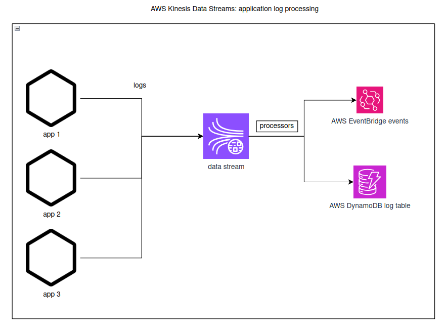

## Real‑time log processing system

### What it does
- **Ingests** app logs via Kinesis Data Streams
- **Processes** logs with a Java KCL consumer on EC2
- **Stores** structured logs in DynamoDB
- **Sends** error-level events to EventBridge

### Architecture (high level)
- Producer app (separate project) writes to Kinesis stream `log-stream`.
- Two EC2 instances run a Java KCL v3 consumer (same application name) to auto‑rebalance across shards.
- Consumer parses JSON, batches side effects (DynamoDB writes), then checkpoints.
- Error-level events are published to EventBridge.

## Implementation details

### KCL consumer
- Version: KCL v3.1.1, SDK v2.
- Scheduler uses polling retrieval; shards are dynamically rebalanced across workers.
- At‑least‑once: side effects complete first (with retries), then checkpoint per batch.
- Backoff: exponential with jitter for DynamoDB batch writes, EventBridge publish, and checkpoints.
- Env config:
  - `KINESIS_STREAM` (default `log-stream`)
  - `KCL_APP_NAME` (default `log-stream-consumer`)
  - `AWS_REGION` (default `us-east-2`)
  - `KCL_INITIAL_POSITION` (`LATEST` by default)
  - `DDB_TABLE` (DynamoDB)
  - `EVENT_BUS` (EventBridge, default `default`)
  - `EVENTBRIDGE_REQUIRED` (optional; if true, you can choose to block checkpoint on alert success)


## Infrastructure
- Terraform creates VPC, two public subnets, IGW, SG (SSH allowed), IAM role/profile, two EC2 instances and DynamoDB table.
- User data installs Docker + compose and exports `DDB_TABLE`, `AWS_REGION`, `KINESIS_STREAM`, `KCL_APP_NAME`.
- Note: Compose file and app artifact/image delivery can be done via S3/SSM or by using a container image from ECR.


### DynamoDB schema
- Table: `log-stream-logs` (PAY_PER_REQUEST)
- Keys:
    - `pk` = service (e.g., `api-gateway`)
    - `sk` = `tsMillis#uuid` for time-ordered reads and uniqueness
- Typical attributes: `level`, `message`, `ts` (epoch millis), optional `service`.

### Query examples
- Latest 50 logs for a service (descending):
```bash
aws dynamodb query \
  --table-name log-stream-logs \
  --key-condition-expression "pk = :svc" \
  --expression-attribute-values '{":svc":{"S":"api-gateway"}}' \
  --no-scan-index-forward \
  --limit 50
```
- Time-window for a service:
```bash
aws dynamodb query \
  --table-name log-stream-logs \
  --key-condition-expression "pk = :svc AND sk BETWEEN :from AND :to" \
  --expression-attribute-values '{":svc":{"S":"api-gateway"}, ":from":{"S":"1723050000000#"}, ":to":{"S":"1723053599999#z"}}'
```

### EventBridge alerts (review)
- Simplicity: A single publisher emits `LogError` events for records with `level=ERROR` to `EVENT_BUS` (default bus by default).
- Resilience: Exponential backoff with jitter on failures.

## Terraform overview

The data stream itself is not in the terraform configuration file!


